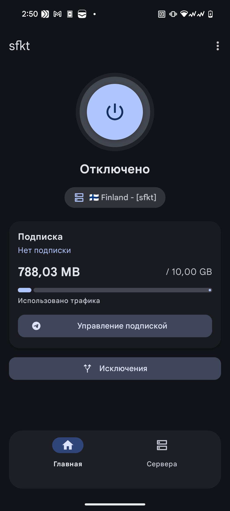

# SafeKitty VPN

VPN-клиент на базе Xray-core для Android.

## Скриншот

## Возможности

- Простой и удобный интерфейс
- Подключение по подписке
- Автоматическое получение списка серверов
- Выбор приложений для VPN (split tunneling)
- Поддержка VLESS, VMess, Trojan, Shadowsocks

## Telegram

[@safekittyvpn_bot](https://t.me/safekittyvpn_bot)

## Основано на

- [XTLS/Xray-core](https://github.com/XTLS/Xray-core)
- [SaeedDev94/Xray](https://github.com/SaeedDev94/Xray)
